   <!-- aesthetic vspace so the title isn't too close to the UCL banner -->

<!-- if html tags appear then: https://github.com/marp-team/marpit/issues/178#issuecomment-511106762 -->

# Erik Burman FEM Error Estimates.

## Project Debrief Talk.

Sam Cunliffe (+ Matt Graham, Matthew Scroggs)

ARC Collaborations' Hour. 2025-08-19.

---

<!--
paginate: true
_footer: © E. Burman, Linkedin.
-->

# What? Who?

- RSE mentoring for two postdocs in [Erik Burman](https://profiles.ucl.ac.uk/36640)'s research group:
  [Janosch Preuẞ](https://www.mps.mpg.de/7387373/pm-20220516-promotionspreis-fuer-janosch-preuss) | [Deepika Garg](https://www.researchgate.net/profile/Deepika-Garg-9).
- Erik is the _Chair of Computational Mathematics_ and an expert on **Finite Element Methods**.
  - Insofar as you should trust _h-index_, his is a big number.

* He's also really friendly.

---

<!--
footer: S. Cunliffe, 2025-08-18.
-->

# FEM in six bullet points

- Solving equations in continuous space or on a continuous surface is hard (/impossible).
- So don't do that.
- Discretise.
- Define a mesh.
- Solve the equations on the mesh.
- Combine to get a global model.

---

<!--
_footer: Image: © UCL
-->

# The Burman group's research

Is it possible to do FEM without boundary conditions?

- Deepika's project: solving fluid dynamics (Navier-Stokes) problems with unknown boundary conditions (or other missing data).
- Janosch's project: solving the wave equation for non-linear problems.

Somewhat common code to do both of these things.

---

<!--
_footer: Logo: © The FEniCS project
-->

# What FEM is _actually_ doing

- Linear systems of equations.
- Matrix multiplications.

# _Actual_ toolstack

- [FEniCSx](https://docs.fenicsproject.org/) - FEM platform;
- [FEniCS/DOLFINx](https://docs.fenicsproject.org/dolfinx/v0.9.0/python/) - (Python) computational environment;
- [gmsh.py](https://gmsh.info) - mesh with a Python API;
- [pyPardiso](https://github.com/haasad/PyPardiso) - sparse solvers;
- [PETSc](https://petsc.org/release/petsc4py/) - parallel solvers;
- [NumPy](https://numpy.org/); [Matplotlib](https://matplotlib.org/).

---

# The ~~RITS/RSDG~~ → ARC collaborations product team project

## Since 2019 (2016)

Opportunity issues: [#329](https://github.com/UCL-ARC/arc-opportunities-tracker/issues/329) | [#399](https://github.com/UCL-ARC/arc-opportunities-tracker/issues/399) ([#34](https://github.com/UCL-ARC/arc-opportunities-tracker/issues/34))

---

<!--
_header: "Image credits: Software Sustainability Institute, A. Georgoulas, J. Quinn"
-->

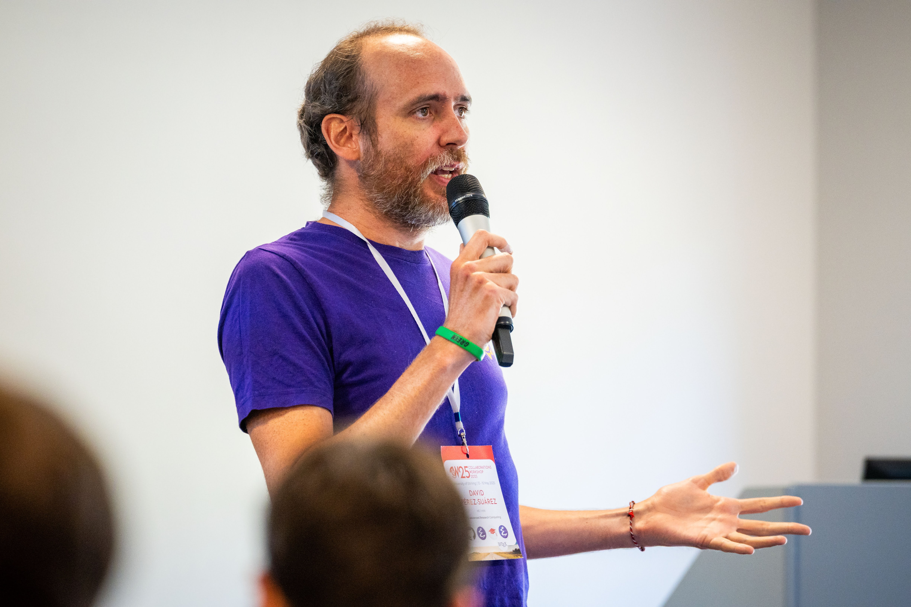

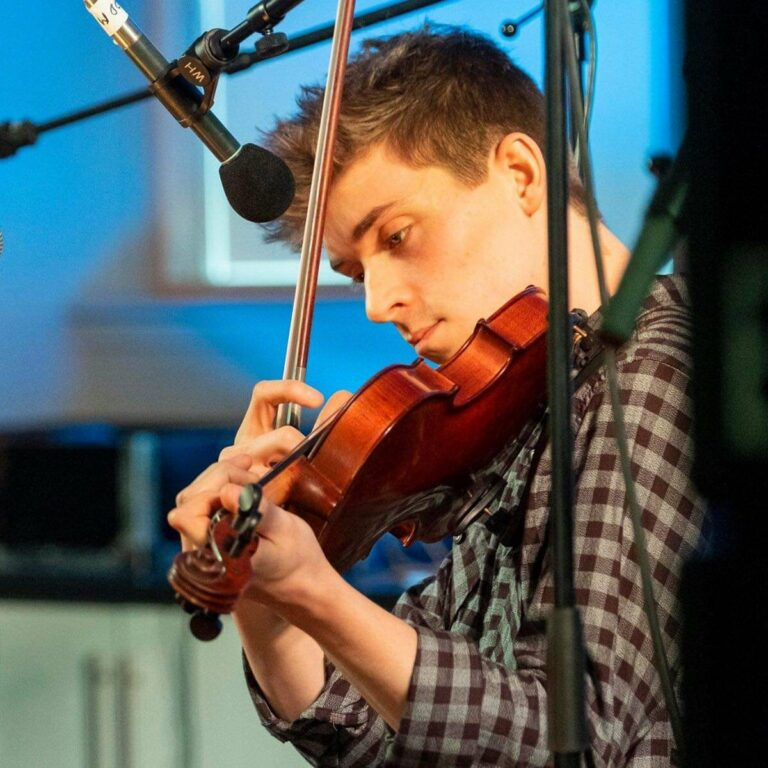

---

# Initial period of mentoring (Oct 2021 - Jul 2022)

## Anastasis, Jamie, Matt G

- Mentoring of two postdocs (Deepika from Nov 2021, Janosch from Apr 2021) on best practices.
- Bar set at: version control, reproducible results in Jupyter, public code for public papers.
  - A lot of confidence-building and guidance through `git`, Docker and virtual environment workflows, using Python.
  - Technical hurdles due to DOLFINx not initially having stable release / pre-built package
  - Example Jupyter notebooks collaboratively developed at https://github.com/UCL/fenics-examples
  - Deepika attended RSE with Python course 👍.
- Initially weekly meetings included {Anastasis, Jamie, Matt} then just Anastasis from Apr 2021.
- Project paused in July 2022 - initially short-term then longer term due to capacity issues.

---

# Mentoring restart (May 2023 - Aug 2023)

## Matt G

- Continues supporting postdocs.
  - Gently encourages them to abstract common functions into a [reusable library](https://github.com/ucl/dxh) (common helper functions, plotting).
- We realise there's more hours than we could use for mentoring.
- Suggest to actively work on postdoc code, move it into a package, potentially help with distributing computation.
- July 2023 TI planning: Matt looks to handover project to allow rotating back to another project (Thanzi la Mawa).

---

# Sam takes over...

## September 2023

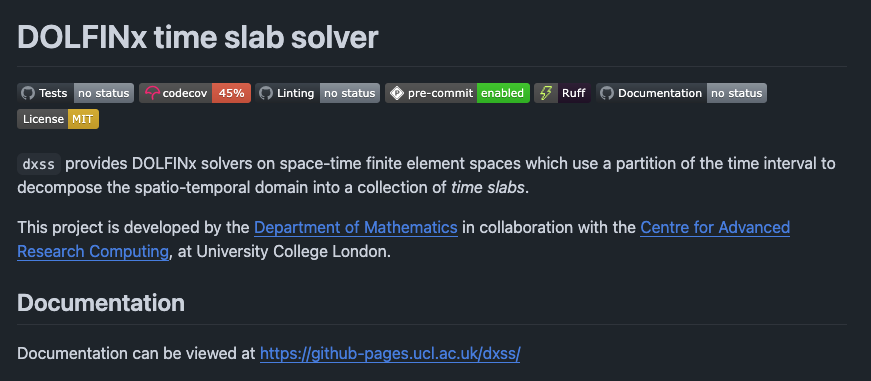

---

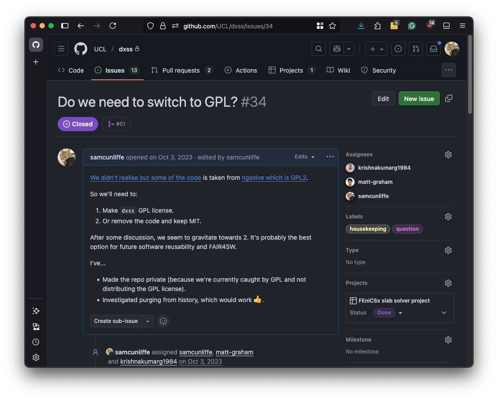

# Code woes

- Agreed on MIT with the postdocs.
- We learned some code was copied from another library: GPL2!

* Re-implemented offending file in "the FEniCSx way".
  - Ended up with much fewer lines and neater code.

---

# Things go South

<!-- prettier-ignore-start -->

* The way the collaborations team measures indirects changes midway.
  - At the end of the month, indirects come in a chunk.
* Both team members have unusually high indirects, burning through hours with little or no delivery.
* Staff and family illness mean we pause.
  - During that time, the postdocs' code advances _a lot_.
* The project goes 🟠 amber (danger of non-delivery) and is paused for a few months.

<!-- prettier-ignore-end -->

---

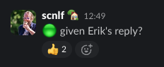
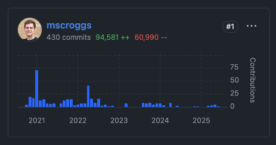

# 🟢 Back to green

## May 2024

> During that time, the postdocs' code advances _a lot_.

- Abandon the idea of a tested, packagified version of the postdoc code.
- The postdocs get publications 🎉.
- Very conveniently, we now hire Matthew Scroggs.
  - Remaining hours transferred to a mini FEniCSx development project.
  - Erik is very happy about this.

---

# Lessons learned

- Double-check the code's origin with the postdocs before applying your preferred license.
- Make sure any deliverable commitments keep up with the pace of the research team's development.
- Long-running hour-per-week mentoring projects suffer when the collaborations team has a high capacity load.
  - "Flexible working" and "dynamic staffing" are great, but so are continuity and building domain expertise.
  - It might actually be possible for a PI to be _too_ nice.
- **Sam Cunliffe** is uncomfortable with the "new" way of handling time-tracking.

---

# What did I do?

- Erik and Silvia Bertoluzza wrote a paper about a new formulation for coupled problems...
- "Can you implement this in FEniCSx?"

---

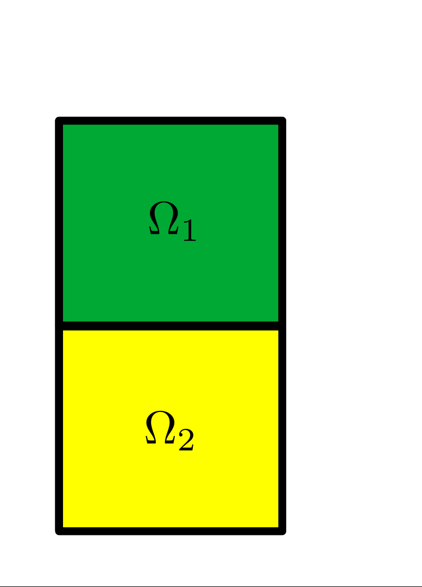

# What is coupling?

- Two parts of the domain where you want:
  - different PDEs?
  - different material properties?
  - different methods?
  - to use different libraries?

---

# Example

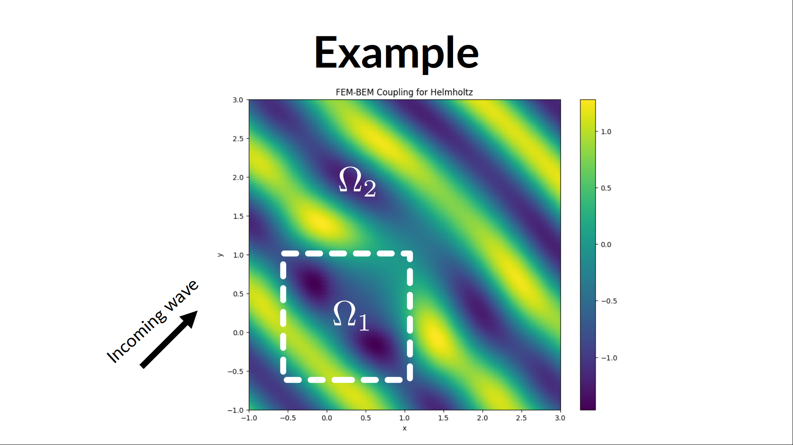

---

# Example

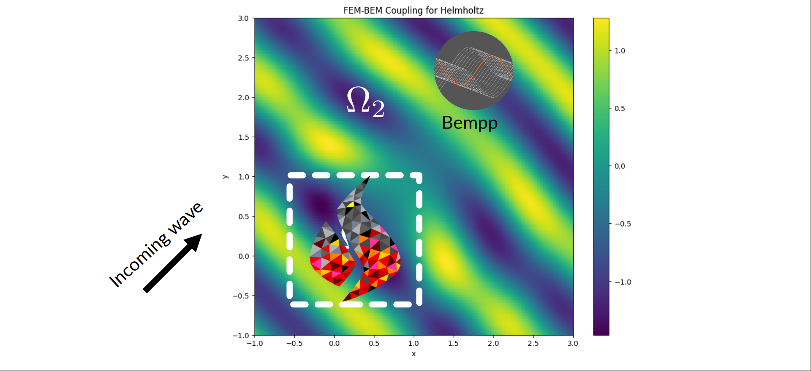

---

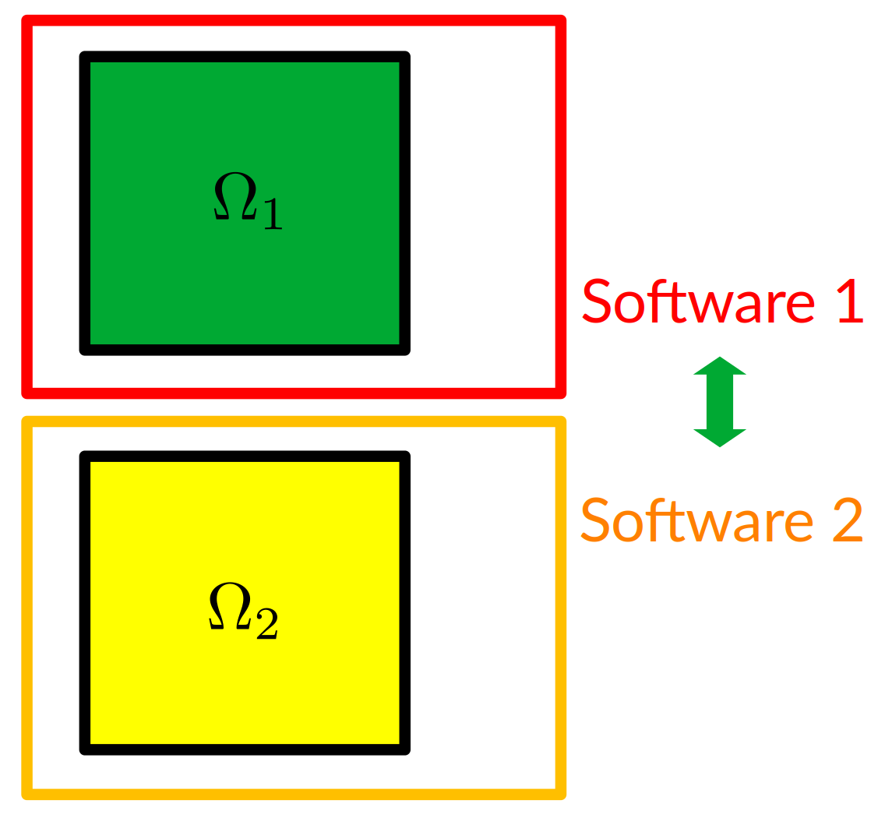

# Implementation

- Write code that maps solution between softwares

* If you want to add a third library, write a lot more code

* If you want to add a fourth library, write too much code

---

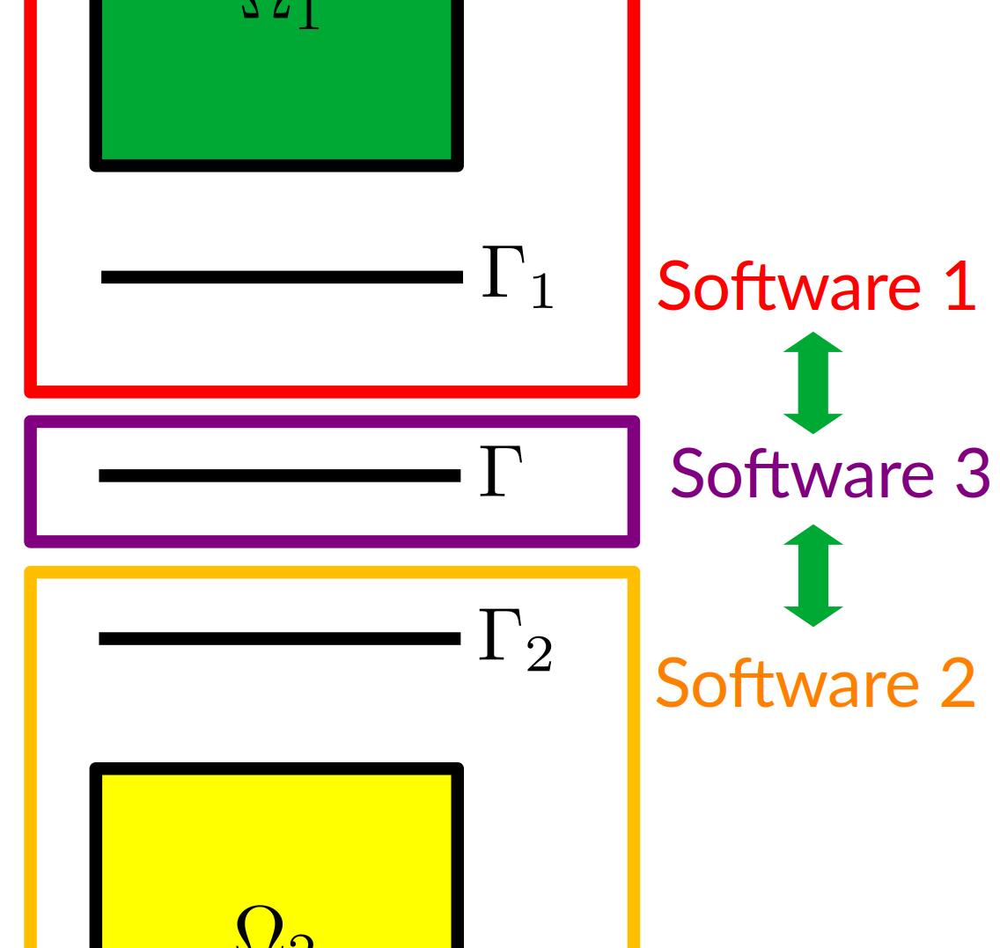

# New method

- Formuate the problem as a integral equation on the boundary between domains
- Map the solution between the boundary and each domain

---

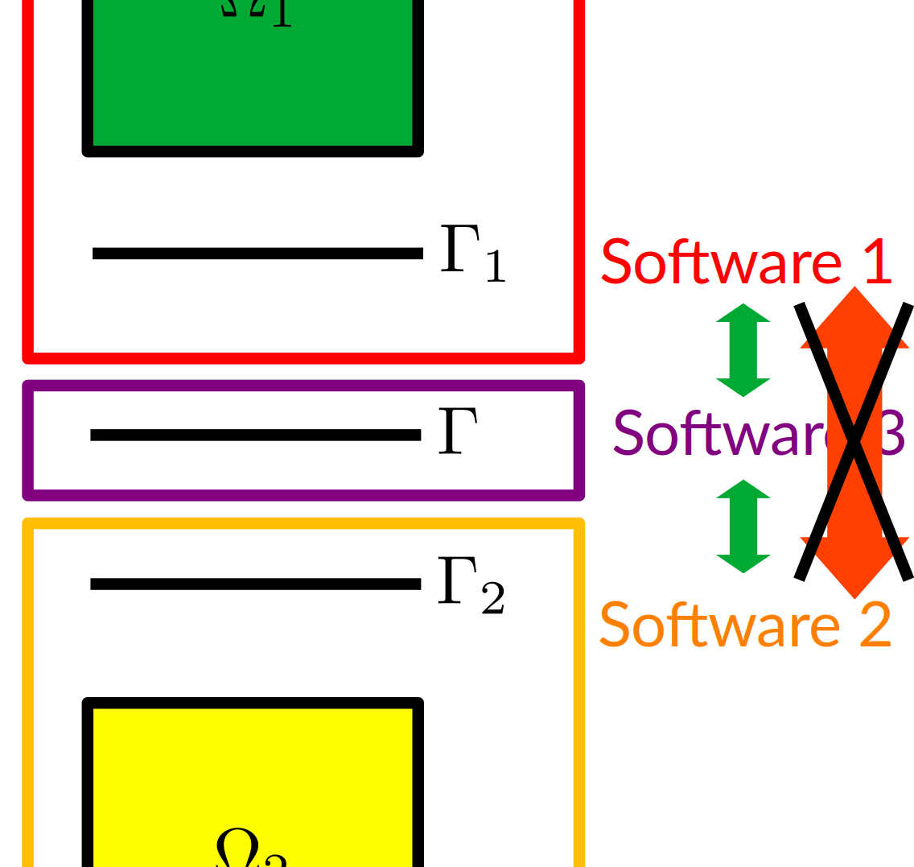

# Importantly,

- No need to get the two domain softwares to talk to each other

---

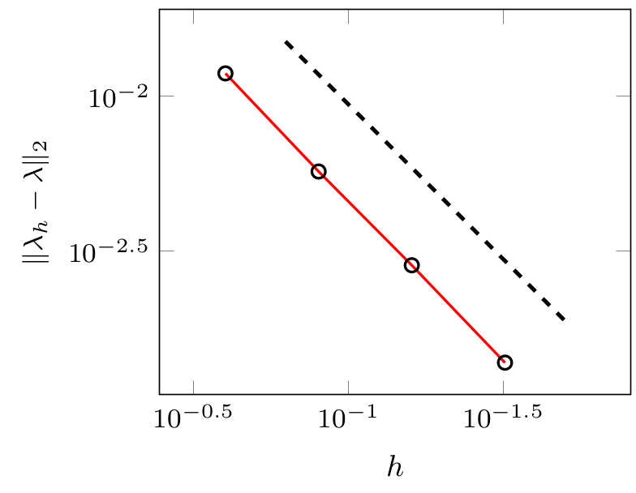

# Implementation

- Proof of concept: couples FEniCSx to FEniCSx via FEniCSx on the boundary
- Example problem with two cubes with non-matching meshes
- [github.com/mscroggs/celement](https://github.com/mscroggs/celement)

---

# Future work

- Make example where boundary is not flat
- Coupling with other libraries

- Erik's applying for a grant to continue work on coupling, including ARC time for implementation

