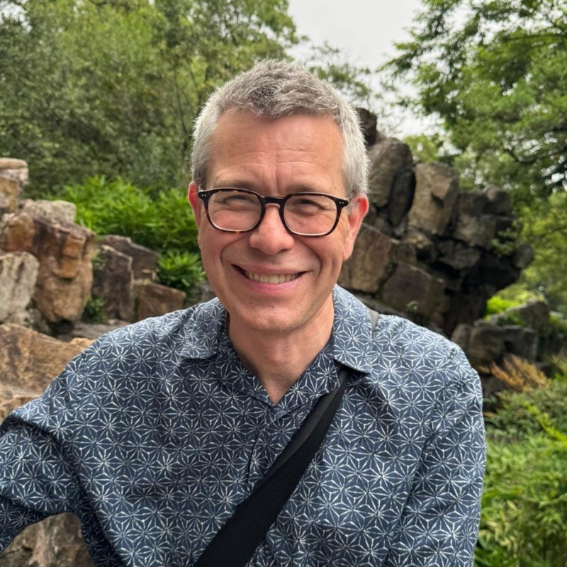
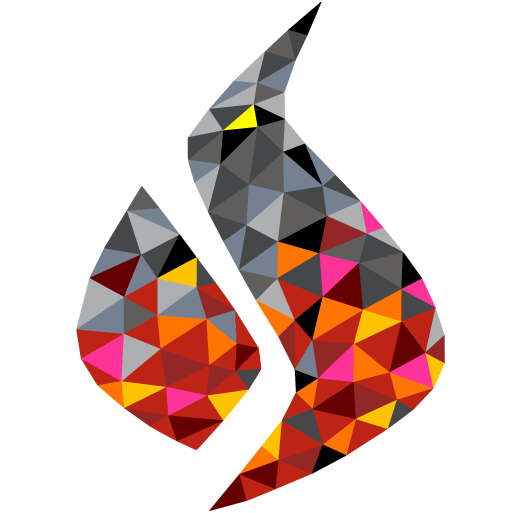

   <!-- aesthetic vspace so the title isn't too close to the UCL banner -->

<!-- if html tags appear then: https://github.com/marp-team/marpit/issues/178#issuecomment-511106762 -->

# Erik Burman FEM Error Estimates.

## Project Debrief Talk.

Sam Cunliffe (+ Matt Graham, Matthew Scroggs)

ARC Collaborations' Hour. 2025-08-19.

---

<!--
paginate: true
_footer: © E. Burman, Linkedin.
-->

# What? Who?

- RSE mentoring for two postdocs in [Erik Burman](https://profiles.ucl.ac.uk/36640)'s research group:
  [Janosch Preuẞ](https://www.mps.mpg.de/7387373/pm-20220516-promotionspreis-fuer-janosch-preuss) | [Deepika Garg](https://www.researchgate.net/profile/Deepika-Garg-9).
- Erik is the _Chair of Computational Mathematics_ and an expert on **Finite Element Methods**.
  - Insofar as you should trust _h-index_, his is a big number.

* He's also really friendly.

---

<!--
footer: S. Cunliffe, 2025-08-18.
-->

# FEM in six bullet points

- Solving equations in continuous space or on a continuous surface is hard (/impossible).
- So don't do that.
- Discretise.
- Define a mesh.
- Solve the equations on the mesh.
- Combine to get a global model.

---

<!--
_footer: Image: © UCL
-->

# The Burman group's research

Is it possible to do FEM without boundary conditions?

- Deepika's project: solving fluid dynamics (Navier-Stokes) problems with unknown boundary conditions (or other missing data).
- Janosch's project: solving the wave equation for non-linear problems.

Somewhat common code to do both of these things.

---

<!--
_footer: Logo: © The FEniCS project
-->

# What FEM is _actually_ doing

- Linear systems of equations.
- Matrix multiplications.

# _Actual_ toolstack

- [FEniCSx](https://docs.fenicsproject.org/) - FEM platform;
- [FEniCS/DOLFINx](https://docs.fenicsproject.org/dolfinx/v0.9.0/python/) - problem description;
- [gmsh.py](https://gmsh.info) - mesh with a Python API;
- [pyPardiso](https://github.com/haasad/PyPardiso) - sparse solvers;
- [PETSc](https://petsc.org/release/petsc4py/) - parallel solvers;
- [NumPy](https://numpy.org/); [Matplotlib](https://matplotlib.org/).

---

# The ~~RITS/RSDG~~ → ARC collaborations product team project

## Since 2019 (2016)

Opportunity issues: [#329](https://github.com/UCL-ARC/arc-opportunities-tracker/issues/329) | [#399](https://github.com/UCL-ARC/arc-opportunities-tracker/issues/399) ([#34](https://github.com/UCL-ARC/arc-opportunities-tracker/issues/34))

---

<!--
_header: "Image credits: Software Sustainability Institute, A. Georgoulas, J. Quinn"
-->

---

# Initial period of mentoring

## Anastasis, Jamie

- Long-running mentoring of two postdocs on best practices.
- Bar set at: version control, reproducible results in Jupyter, public code for public papers.
  - Mostly confidence-building and guidance through `git` and virtual environment workflows.
  - Postdocs attended Software Carpentries.
- A _lot_ of pausing (during the time when we were at very high capacity).

---

# Matt (Graham) takes over

## May 2023

- Matt supports postdocs and gently pushes them to abstract things into a [reusable library](https://github.com/ucl/dxh) (common helper functions, plotting).
- We realise there's more hours than we could use for mentoring.
- Suggest to actively work on postdoc code, move it into a package.
- Matt realises he's needed by Thanzi la Onse.

---

# Sam takes over...

## September 2023

---

# But things go south

> Suggest to actively take postdoc code, move it into a package.

<!-- prettier-ignore-start -->

* The way the collaborations team measures indirects changes midway.
  - At the end of the month, indirects come in a chunk.
* Both team members have unusually high indirects, burning through hours with little or no delivery.
* Staff and family illness mean we pause.
  - During that time, the postdocs' code advances _a lot_.
* The project goes 🔴 red and is paused for a few months.

<!-- prettier-ignore-end -->

---

# Code woes

- Agreed on MIT with the postdocs.
- We learned some code was copied from another library: GPL2!

* Re-implemented offending file in "the FEniCSx way".
  - Ended up with much fewer lines and neater code.

---

# 🟢 Back to green

## May 2024

- In the end, we're overtaken by our postdoc's code development pace.
- The postdocs get publications 🎉.
- Very conveniently, we now hire Matthew Scroggs.
  - Remaining hours transferred to a mini FEniCSx development project.
  - Erik is very happy about this.

---

# Lessons learned

- Double-check the code's origin with the postdocs before applying your preferred license.
- Make sure any deliverable commitments keep up with the pace of the research team's development.
- Long-running hour-per-week mentoring projects suffer when the collaborations team has a high capacity load.
  - "Flexible working" and "dynamic staffing" are great, but so are continuity and building domain expertise.
  - It might actually be possible for a PI to be _too_ nice.
- **Sam Cunliffe** is uncomfortable with the "new" way of handling time-tracking.
